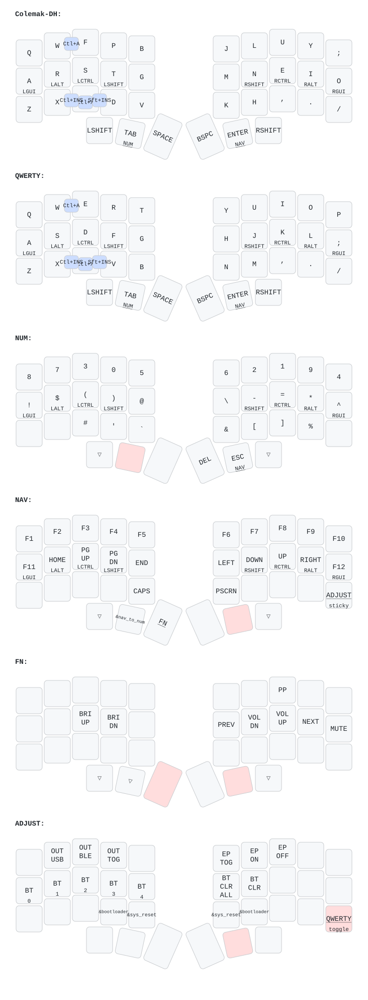

# Chocofi ZMK config



This repository builds firmware for a 36-key low-profile Chocofi with two
`nice_nano_v2` controllers. It uses a pinned fork of the ZMK v0.3 release line
with a synchronous effective-modifier snapshot event: the left half is the
split central and the right half is the split peripheral. The Bluetooth name
is `Chocochap`.

The project is intentionally local-only and has no CI build matrix. It includes
optional encrypted key/layer telemetry on the left central; ordinary HID use
and the right peripheral firmware do not require telemetry.

## Locked firmware base

Release names below identify the corresponding upstream release for humans;
builds use only the full commit hashes.

| Component | Release | Effective revision |
| --- | --- | --- |
| ZMK fork | `wochap/zmk` `v0.3-branch-fork` | `a301f6d562bd67f18e496402f8cf6c87326b05b2` |
| ZMK Zephyr fork | v3.5.0+zmk-fixes | `dacab4875df72109b96cc8977547a0dc04875bcd` |
| Nixpkgs | nixos-26.05 snapshot (10 July 2026) | `0ad6f47ea4fe188f4bc8f0380f93ae8523337c6c` |
| nix-community/zephyr-nix | SDK/Python packaging | `a12131ec450ea66e9005c668c31c8a055a766ef3` |

`config/west.yml` pins ZMK and overrides its symbolic Zephyr import with the
exact Zephyr commit above. Imported west projects remain pinned by the
immutable manifests at those commits. `flake.lock` fixes every Nix input and
content hash. The development shell provides West, Zephyr SDK 0.16.8, a host C
compiler, Python 3, BlueZ's `bluetoothctl`, and keymap-drawer.

## Initialize locally with Nix

Install Nix with flakes enabled, clone this repository, and run:

```sh
nix develop
just init
```

`just init` initializes the repository as a west workspace, checks out the
pinned projects, and exports Zephyr's CMake package. Run `just update` later to
restore the same declared immutable revisions; it does not advance them.

Run the host checks before building:

```sh
just test
python3 -m py_compile scripts/test-telemetry.py
```

The protocol test compiles as C11 with warnings as errors in a temporary
directory that the recipe removes on completion.

## Build firmware

Enter `nix develop`, then build either image independently:

```sh
just build-left
just build-right
```

Or build both with:

```sh
just build-all
```

Every recipe requests a pristine build for `nice_nano_v2` and passes the
absolute vendored `modules/zmk-key-telemetry` path through `ZMK_EXTRA_MODULES`.
The module is discovered for both halves but enabled only by
`config/corne_left.conf`; it is not a west project and does not modify pinned
ZMK or Zephyr. The copied output files are:

- `firmware/corne_left-nice_nano_v2.uf2` — central, host-facing half
- `firmware/corne_right-nice_nano_v2.uf2` — peripheral half

`just clean` removes only build and copied firmware outputs.

## Flashing

**IMPORTANT:** Always flash the **RIGHT** side first, then the left side

Keep a copy of the last known-good firmware as a recovery baseline. Flash the
right/peripheral image first, then flash the left/central image. Put each
nice!nano into its UF2 bootloader and copy the matching file to the mounted
bootloader drive.

After flashing, verify base typing, home-row holds, thumb layer-taps, layer
transitions, editing combos, Bluetooth profiles, and USB/BLE output selection.
If hardware-only behavior differs, reflash the retained recovery images.

If BlueZ does not discover telemetry after an upgrade, remove and re-pair
`Chocochap` to clear its stale GATT cache.

## Optional BLE telemetry

The left firmware exposes an encrypted read/notify protocol-v2 authoritative
state frame. Each 48-byte frame includes global pressed positions, active and
default layers, the complete effective HID modifier byte, sequence/timestamp,
validity and change masks, dropped-frame count, and—when available—HID
indicators, selected transport/profile, both batteries, and split status. It
sends no labels, bindings, or geometry; desktop presentation remains in
`draw/corne.yaml`.

Events only mark the snapshot dirty. A short deferred work item lets the
current synchronous ZMK behavior chain settle, reads authoritative state, and
emits one coalesced frame. The modifier source is the fork's
`zmk_hid_modifiers_changed` event, raised after the effective HID report byte is
updated. Every listener bubbles normal ZMK events, and telemetry loss cannot
block HID or split operation. The runtime guard requires an ATT MTU of at least
51; this keyboard has been measured negotiating MTU 65 (62 notification bytes).

After flashing right first and left second, pair or re-pair the keyboard and run
the verifier on a host with Bluetooth access:

```sh
python3 scripts/test-telemetry.py
python3 scripts/test-telemetry.py XX:XX:XX:XX:XX:XX
```

The Nix shell provides Python and `bluetoothctl`, but a container still needs
access to the host Bluetooth controller and system BlueZ D-Bus for live use.
See [docs/telemetry.md](docs/telemetry.md) for stable UUIDs, the protocol table,
synchronization/loss behavior, direct build commands, cache recovery, and the
manual verification procedure.

## Keymap structure

Layer IDs are centralized in `config/layers.h` and remain:

| ID | Layer |
| ---: | --- |
| 0 | Colemak-DH |
| 1 | QWERTY |
| 2 | NUM |
| 3 | NAV |
| 4 | FN |
| 5 | ADJUST |

The keymap selects ZMK's `foostan_corne_5col_layout`, so every layer has the native 36
positions documented in `config/key_positions.h`. The historical six unused
outer-column placeholders are gone; combos and positional hold triggers are
translated by physical key into the `0-35` position space.

Reusable home-row, layer-tap, and macro behaviors live in
`config/custom_behaviors.dtsi`; layer bindings and combos remain readable in
`config/corne.keymap`. All behavior definitions use ZMK devicetree APIs without
helper modules.

Regenerate the committed keymap-drawer outputs with:

```sh
just draw
```

This writes `draw/corne.yaml` and `draw/corne.svg`. See
`docs/validation.md` for the build and static-equivalence audit.
